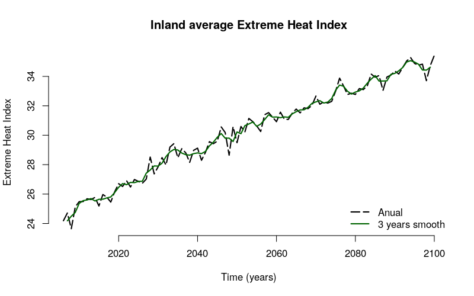
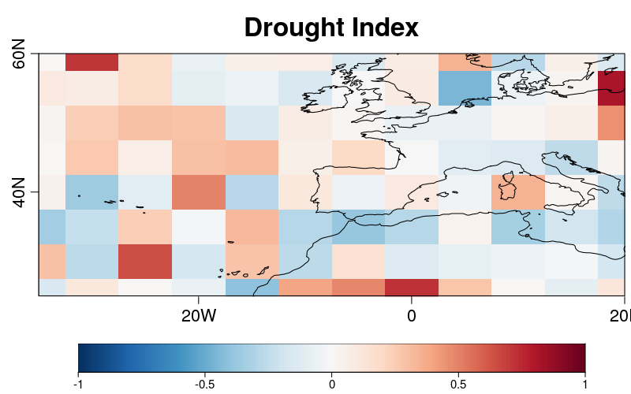
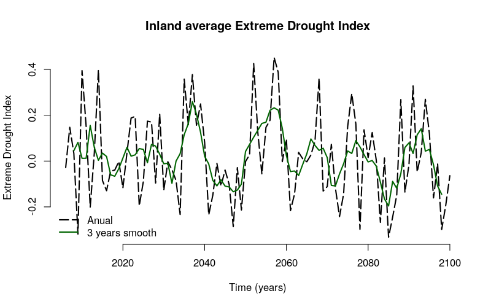
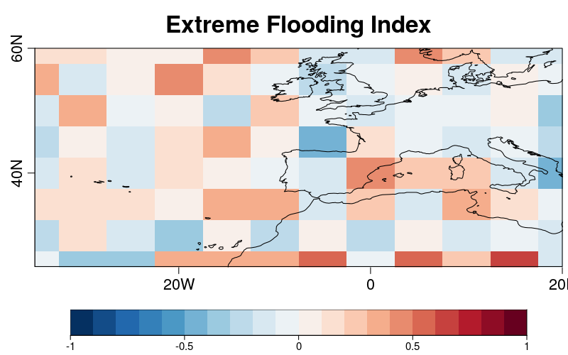
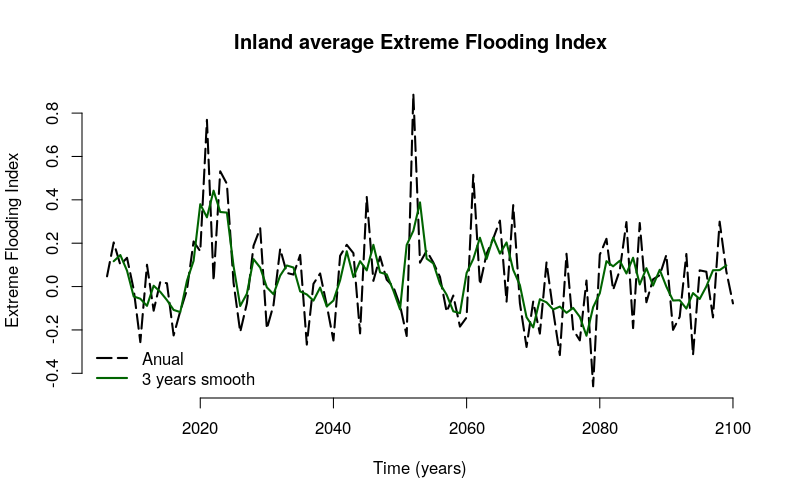
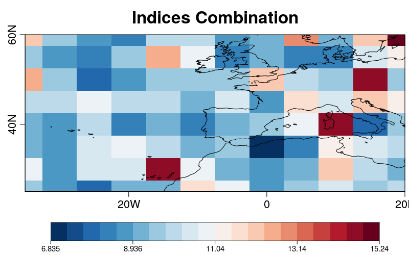

Extreme Indices
========================


The extreme indices are an ensemble of indices based on the Expert Team on Climate Change Detection Indices (ETCCDI). There are currently 5 available indices to be computed: extreme heat (tx90p), extreme cold (tn10p), extreme wind (wx), drought (ccd) and flooding (rx5day). The individual indices can be combined into a single index with or without weighting for each component. This combined index is roughly analogous to the Actuaries Climate Risk Index (see http://actuariesclimateindex.org/home/).


### 1- Load dependencies


This example requires the following system libraries:

- libssl-dev
- libnecdf-dev
- cdo


The **ClimProjDiags R package** should be loaded by running the following lines in R once it's integrated into CRAN mirror.


```r
library(ClimProjDiags)
```


All the other R packages involved can be installed directly from CRAN and loaded as follows:


```r
library(s2dverification)
library(abind)
library(multiApply)
library(ggplot2)
library(parallel)
```


### 2- Synthetic data


Daily maximum and minimum temperature, wind speed and precipitation are necessary to compute the different indices in both, the reference period (1971 - 2000) and the future projection (2006 - 2100). The defined region will be in the northern hemisphere between -40 - 20 ºE and 25 - 60 ºN.

Maximum temperature is generated considering the annual cycle:


```r
lat <- seq(25, 60, 5)
lon <- seq(-35, 20 ,5)
tmax_historical <- NULL
grid1 <- 293 - 10 * cos(2 * pi / 365 * (1 : 10958)) + rnorm(10958)
gridlon <- NULL
for (i in 1 : 12) {
  gridlon <- cbind(gridlon, 
                   grid1 + rnorm(10958, sd = 5) * cos(2 * pi / 365 * (1 : 10958)))
}
for (j in 1 : 8) {
  gridnew <- apply(gridlon, 2, function(x) {x - rnorm(10958, mean = j * 0.5, sd = 3)})
  tmax_historical <- abind(tmax_historical, gridnew, along = 3)
}
tmax_historical <- InsertDim(InsertDim(tmax_historical, posdim = 1, lendim = 1), 
                             posdim = 1, lendim = 1)
names(dim(tmax_historical)) <- c("model", "var", "time", "lon", "lat")
time <- seq(ISOdate(1971, 1, 1), ISOdate(2000, 12, 31), "day")
metadata <- list(time = list(standard_name = 'time', long_name = 'time', 
                             calendar = 'proleptic_gregorian',
                             units = 'days since 1970-01-01 00:00:00', prec = 'double', 
                             dim = list(list(name = 'time', unlim = FALSE))))
attr(time, "variables") <- metadata
attr(tmax_historical, 'Variables')$dat1$time <- time
```


A similar procedure is considered to build the synthetic data for the future projections. However, a little trend is added.


```r
tmax_projection <- NULL
grid1 <- 298 - 10 * cos(2 * pi / 365 * (1 : 34698)) + rnorm(34698) + 
         (1 : 34698) * rnorm(1, mean = 4) / 34698
gridlon <- NULL
for (i in 1 : 12) {
  gridlon <- cbind(gridlon, grid1 + rnorm(34698, sd = 5) * 
                                    cos(2 * pi / 365 * (1 : 34698)))
}
for (j in 1 : 8) {
  gridnew <- apply(gridlon, 2, function(x) {x - 
                               rnorm(34698, mean = j * 0.5, sd = 3)})
  tmax_projection <- abind(tmax_projection, gridnew, along = 3)
}
tmax_projection <- InsertDim(InsertDim(tmax_projection, posdim = 1, lendim = 1), posdim = 1, lendim = 1)
names(dim(tmax_projection)) <- c("model", "var", "time", "lon", "lat")
time <- seq(ISOdate(2006, 1, 1), ISOdate(2100, 12, 31), "day")
metadata <- list(time = list(standard_name = 'time', long_name = 'time', 
                             calendar = 'proleptic_gregorian',
                             units = 'days since 1970-01-01 00:00:00', prec = 'double', 
                             dim = list(list(name = 'time', unlim = FALSE))))
attr(time, "variables") <- metadata
attr(tmax_projection, 'Variables')$dat1$time <- time
```


To build synthetic precipitation data, a lognormal distribution is considered:


```r
ppt_historical <- rlnorm(10958 * 12 * 8)
dim(ppt_historical) <- c(model = 1, var = 1, time = 10958, lon = 12, lat = 8)
time <- seq(ISOdate(1971, 1, 1), ISOdate(2000, 12, 31), "day")
metadata <- list(time = list(standard_name = 'time', long_name = 'time', 
                             calendar = 'proleptic_gregorian',
                             units = 'days since 1970-01-01 00:00:00', prec = 'double', 
                             dim = list(list(name = 'time', unlim = FALSE))))
attr(time, "variables") <- metadata
attr(ppt_historical, 'Variables')$dat1$time <- time
ppt_projection <- rlnorm(34698 * 12 * 8)
dim(ppt_projection) <- c(model = 1, var = 1, time = 34698, lon = 12, lat = 8)
time <- seq(ISOdate(2006, 1, 1), ISOdate(2100, 12, 31), "day")
metadata <- list(time = list(standard_name = 'time', long_name = 'time', 
                             calendar = 'proleptic_gregorian',
                             units = 'days since 1970-01-01 00:00:00', prec = 'double', 
                             dim = list(list(name = 'time', unlim = FALSE))))
attr(time, "variables") <- metadata
attr(ppt_projection, 'Variables')$dat1$time <- time
```


### 3- Computing the Extreme Heat Index


The Extreme Heat Index (*t90p*) is defined as the percentage of days when the maximum temperature exceeds the 90th percentile. 


In order to evaluate the future projections, it is necessary to compute the index during a reference historical period. 
The next steps should be followed:


To remove seasonality effects, the anomaly is computed for each day and gridpoint by applying the `DailyAno` function. The name of the first dimensions is defined as 'time' dimension. 


```r
anomaly_data <- apply(tmax_historical, c(1,2,4,5), DailyAno, dates = attributes(tmax_historical)$Variables$dat1$time)

names(dim(anomaly_data))[1] <- "time"
```


This data can be detrended by applying the `Trend` function from **s2dverification package**. In order to remove the trend from the `tmax_historical`, the correction is calculated by subtracting the `detrended_data` to the `anomaly_data`.
 

```r
detrended_data <- Trend(anomaly_data, 
                        posTR = which(names(dim(anomaly_data)) == "time"))
diff <- anomaly_data - detrended_data$detrended
diff <- aperm(diff, c(2,3,1,4,5))
detrended_data <- tmax_historical - diff
```


For each gridpoint and day of the year (from the 1st of January to the 31st of December), the maximum temperature on the position at the 90 percent of the series will be calculated as the threshold. 


```r
quantile <- 0.9
thresholds <- Threshold(detrended_data, qtiles = quantile, 
                        ncores = detectCores() -1)
```


```r
> dim(thresholds)
jdays model   var   lon   lat 
  366     1     1    12     8 
```


By indicating the metric and introducing the threshold, `Climdex()` function will return the extreme heat index during the reference period.


```r
base_index <- Climdex(data = detrended_data, metric = 't90p', 
                      threshold = thresholds, ncores = detectCores() - 1)
```


The output of ´Climdex´ function will be a ´list()´ object. Index values are saved in the ´base_index$result´ label.


```r
> str(base_index)
List of 2
 $ result: num [1:30, 1, 1, 1:12, 1:8] 11.23 8.74 10.41 11.78 10.14 ...
 $ years : num [1:30] 1971 1972 1973 1974 1975 ...
> dim(base_index$result)
 year model   var   lon   lat 
   30     1     1    12     8 
```


Now, the standard deviation is computed in order to standardize the index. Notice that, by definition, the mean of the percentage of the number of days exceeding the 90th percentile is 10. Only standard deviation is computed.


```r
base_sd <- Apply(list(base_index$result), target_dims = list(c(1)), 
                 AtomicFun = "sd")$output1
```


The index can be computed by considering the threshold obtain for the reference period.


```r
projection_index <- Climdex(data = tmax_projection, metric = 't90p', 
                            threshold = thresholds, ncores = detectCores() - 1)
```


It is normalized with mean 10 and the standard deviation of the reference period.


```r
base_mean <- 10
base_sd <- InsertDim(base_sd, 1, dim(projection_index$result)[1])
HeatExtremeIndex <- (projection_index$result - base_mean) / base_sd
```


A spatial representation of the mean index values is obtained and saved in PNG format in the working directory with the name: "SpatialExtremeHeatIndex.png". The matrix `masc` is built and shown as dots in the plot indicating wich pixels are considered land.


```r
masc <- rep(0, 8 * 12)
masc[c(5 : 12, 18 : 24, 31 : 34, 43, 44, 47, 56 : 60, 67 : 72, 79, 
       82 : 84, 93 : 96)] <- 1
dim(masc) <- c(12, 8)
PlotEquiMap(Mean1Dim(HeatExtremeIndex, 
                     which(names(dim(HeatExtremeIndex)) == "year")), 
                     lon = lon, lat = lat, filled.continents = FALSE, 
                     toptitle = "Extreme Heat Index", dots = masc,
                     fileout = "SpatialExtremeHeatIndex.png")
```


The inland average of the Extreme Heat Index can be computed to plot its time evolution using `WeigthedMean` function. `Smoothing()` returns the smoothed time series for a 3 year moving window which can be modified using `runmeanlen` parameter.


```r
temporal <- WeightedMean(HeatExtremeIndex, lon = lon, lat = lat, mask = drop(masc))
temporal_3ysmooth <- Smoothing(temporal, runmeanlen = 3, numdimt = 1)
```


The next code should be run to plot and save the original average and the 3 year smoothed data.


```r
png("Temporal_Inland_ExtremeHeatIndex.png", width = 8, height = 5, units = 'in', 
    res = 100, type = "cairo")
  plot(2006 : 2100, temporal, type = "l", lty = 5, lwd = 2, bty = 'n', 
       xlab = "Time (years)", ylab = "Extreme Heat Index", 
       main = "Inland average Extreme Heat Index")
  lines(2006 : 2100, temporal_3ysmooth, col = "darkgreen", lwd = 2)
  legend('bottomright', c('Anual', '3 years smooth'), col = c(1, 'darkgreen'), 
         lty = c(5, 1), lwd = 2, bty = 'n')
dev.off()
```





### 4- Extreme Drought Index


The Extreme Drought Index (*cdd*), which measures the maximum length of a dry spell, is defined as the maximum number of consecutive days with the daily precipitation amount lower than 1 mm. 


To compute the Extreme Drought Index during the reference period and its standard deviation and mean:


*Note: Precipitation data is not detrended. Furthermore, this index doesn't require to compute a threshold as `Climdex` function integrates the threshold of precipitation amount lower than 1 mm internally. However, this case requires the calculation of the mean.*


```r
base_index <- Climdex(data = ppt_historical, metric = 'cdd',  
                      ncores = detectCores() - 1)
base_mean <-  Apply(list(base_index$result), target_dims = list(c(1)), 
                    AtomicFun = "mean")$output1
base_sd <- Apply(list(base_index$result), target_dims = list(c(1)), 
                 AtomicFun = "sd")$output1
```


The object `base_index` contains the output of the `Climdex` function as two list with the next dimensions:


```r
> str(base_index)
List of 2
 $ result: num [1:30, 1, 1, 1:12, 1:8] 6 11 8 8 8 12 9 10 6 8 ...
 $ years : num [1:30] 1971 1972 1973 1974 1975 ...
``` 


The Extreme Drought Index is computed and standardized:


```r
projection_index <- Climdex(data = ppt_projection, metric = 'cdd', 
                            ncores = detectCores() - 1)
base_mean <- InsertDim(base_mean, 1, dim(projection_index$result)[1])
base_sd <- InsertDim(base_sd, 1, dim(projection_index$result)[1])
DroughtExtremeIndex <- (projection_index$result - base_mean) / base_sd
```


Spatial representation of the Extreme Drought Index:


```r
PlotEquiMap(Mean1Dim(DroughtExtremeIndex, 
                     which(names(dim(DroughtExtremeIndex)) == "year")), 
            lon = lon, lat = lat, filled.continents = FALSE, 
            toptitle = "Drought Index", brks = seq(-1, 1, 0.01), 
            fileout = "SpatialDroughtIndex.png")
```





Evolution of inland average of the Extreme Drought Index:


```r
temporal <- WeightedMean(DroughtExtremeIndex, lon = lon, lat = lat, 
                         mask = drop(masc))
temporal_5ysmooth <- Smoothing(temporal, runmeanlen = 5, numdimt = 1)
png("Temporal_Inland_ExtremeDroughtIndex.png", width = 8, height = 5, units= 'in', 
    res = 100,  type = "cairo")
plot(2006: 2100, temporal, type = "l", lty = 5, lwd = 2, bty = 'n', 
     xlab = "Time (years)", ylab = "Extreme Drought Index", 
     main = "Inland average Extreme Drought Index")
lines(2006 : 2100, temporal_5ysmooth, col = "darkgreen",lwd = 2)
legend('bottomleft', c('Anual', '3 years smooth'), col= c(1, 'darkgreen'),
        lty = c(5, 1), lwd = 2, bty = 'n')
dev.off()
```





### 5- Extreme Flooding Index


The Extreme Flooding Index (*rx5day*) is defined as the maximum precipitation amount in 5 consecutive days. 


The Extreme Flooding Index during the reference period and its standard deviation and mean can be calculated by executing:


```r
base_index <- Climdex(data = ppt_historical, metric = 'rx5day',  
                      ncores = detectCores() - 1)
base_mean <-  Apply(list(base_index$result), target_dims = list(c(1)), 
                    AtomicFun = "mean")$output1
base_sd <- Apply(list(base_index$result), target_dims = list(c(1)), 
                 AtomicFun = "sd")$output1
```

The Extreme Flooding Index is computed and standardized:


```r
projection_index <- Climdex(data = ppt_projection, metric = 'rx5day', 
                            ncores = detectCores() - 1)
base_mean <- InsertDim(base_mean, 1, dim(projection_index$result)[1])
base_sd <- InsertDim(base_sd, 1, dim(projection_index$result)[1])
FloodingExtremeIndex <- (projection_index$result - base_mean) / base_sd
```


Spatial representation of the Extreme Flooding Index:


```r
PlotEquiMap(Mean1Dim(FloodingExtremeIndex, 
            which(names(dim(FloodingExtremeIndex)) == "year")), lon = lon, 
            lat = lat, filled.continents = FALSE, 
            toptitle = "Extreme Flooding Index", 
            brks = seq(-1, 1, 0.1), fileout = "SpatialFloodingIndex.png")
```





- Evolution of inland average of the Extreme Flooding Index:


```r
temporal <- WeightedMean(FloodingExtremeIndex, lon = lon, lat = lat, 
                         mask = drop(masc))
temporal_3ysmooth <- Smoothing(temporal, runmeanlen = 3, numdimt = 1)
png("Temporal_Inland_ExtremeFloodingIndex.png", width = 8, height = 5, 
    units= 'in', res = 100, type = "cairo")
plot(2006 :  2100, temporal, type = "l", lty = 5, lwd = 2, bty = 'n', 
     xlab = "Time (years)", ylab = "Extreme Flooding Index", 
     main = "Inland average Extreme Flooding Index")
lines(2006 :  2100, temporal_3ysmooth, col = "darkgreen",lwd = 2)
legend('bottomleft', c('Anual', '3 years smooth'), col= c(1, 'darkgreen'), 
       lty = c(5, 1), lwd = 2, bty = 'n')
dev.off()
```





### 6- Combining Indices


The individual indices can be combined into a single index with or without weighting for each component. This combined index is roughly analogous to the Actuaries Climate Risk Index. Extreme Indices should be saved in the same `list` object.


```r
indices <- list()
indices[[1]] <- HeatExtremeIndex
indices[[2]] <- DroughtExtremeIndex
indices[[3]] <- FloodingExtremeIndex
```

If the `weights` parameter is defined as `NULL`, all indices will be equally weighted if the `operation` parameter is set as `mean` (by default). To define other `weights` a vector of length equal to the number of considered indices (5 in this example) and with total sum equal to 1. 


```r
aci <- CombineIndices(indices = indices, weights = NULL)
```


A spatial visualization can be performed by executing:


```r
PlotEquiMap(Mean1Dim(aci, which(names(dim(aci)) == "year")), lon = lon, 
            lat = lat,  filled.continents = FALSE, toptitle = "Indices Combination",
            fileout = "CombinedIndices.png")
```





*Note: This vignette shows the computation of three indices, however, five different indices can be computed with the `Climdex` function. To consider other combination settings run `?CombinedIndices`.*
