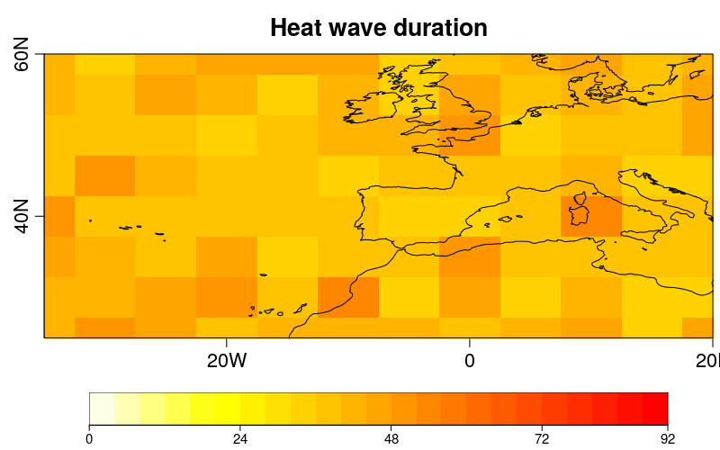

Heatwave and coldwave duration
==============================

Heatwave and coldwave duration is considered to be the total duration of "extreme spells", i.e. the total number of days in a season when the temperature exceeds a threshold for a given number of consecutive days. Other tools for computing such events are also available, but the novelty of this tool is that the users can select their own thresholds (based on quantiles) and the minimum duration of an event. The duration of heatwaves and coldwaves helps to understand potential changes in energy demand.


### 1- Load dependencies

This example requires the following system libraries:

- libssl-dev
- libnecdf-dev
- cdo


The **ClimProjDiags R package** should be loaded by running the following lines in R onces it's integrated into CRAN mirror.

```r
library(ClimProjDiags)
```

All the other R packages involved can be installed directly from CRAN and loaded as follows:

```r
library(abind)
library(s2dv)
library(parallel)
```

The ilustrative problem is to analyze the daily maximum or minimum air temperature at 2m. The reference period used to compute a threshold is 1971 - 2000. The future scenario chosen is the rcp2.6 during the period 2006 - 2100 for which the heat/cold wave duration will be determined. Finally, the region selected in the northern hemisphere is between -40 - 20 ºE and 25 - 60 ºN.

These parameters are defined by running:

```r
var <- 'tasmax'

start_climatology <- '1971'
end_climatology <- '2000'

start_projection <- '2006'
end_projection <- '2100'

lat <- seq(25, 60, 5)
lon <- seq(-35, 20 ,5)
```

A synthetic sample of data for the reference period is built by adding random perturbations to a sinusoidal function. The latitudinal behavior of the temperature is considered by randomly subtracting a value proportional to the latitude. Furthermore, attributes of time and dimensions are added.


```r
tmax_historical <- NULL
grid1 <- 293 - 10 * cos(2 * pi / 365 * (1 : 10958)) + rnorm(10958)
gridlon <- NULL
for (i in 1 : 12) {
  gridlon <- cbind(gridlon, grid1 + rnorm(10958, sd = 5) * 
                                    cos(2 * pi / 365 * (1 : 10958)))
}
for (j in 1 : 8) {
  gridnew <- apply(gridlon, 2, function(x) {x - rnorm(10958, mean = j * 0.5, sd = 3)})
  tmax_historical <- abind(tmax_historical, gridnew, along = 3)
}
names(dim(tmax_historical)) <- c("time", "lon", "lat")
tmax_historical <- InsertDim(InsertDim(tmax_historical, posdim = 1, 
                             lendim = 1, name = "var"),
                             posdim = 1, lendim = 1, name = "model")
time <- seq(ISOdate(1971, 1, 1), ISOdate(2000, 12, 31), "day")
metadata <- list(time = list(standard_name = 'time', long_name = 'time', 
                             calendar = 'proleptic_gregorian',
                             units = 'days since 1970-01-01 00:00:00', prec = 'double', 
                             dim = list(list(name = 'time', unlim = FALSE))))
attr(time, "variables") <- metadata
attr(tmax_historical, 'Variables')$dat1$time <- time
```

A similar procedure is considered to build the synthetic data for the future projections. However, a small trend is added.
´

```r
tmax_projection <- NULL
grid1 <- 298 - 10 * cos(2 * pi / 365 * (1 : 34698)) + 
         rnorm(34698) + (1 : 34698) * rnorm(1, mean = 4) / 34698
gridlon <- NULL
for (i in 1 : 12) {
  gridlon <- cbind(gridlon, grid1 + rnorm(34698, sd = 5) * 
                                    cos(2 * pi / 365 * (1 : 34698)))
}
for (j in 1 : 8) {
  gridnew <- apply(gridlon, 2, function(x) {x - rnorm(34698, mean = j * 0.5, 
                                                      sd = 3)})
  tmax_projection <- abind(tmax_projection, gridnew, along = 3)
}
names(dim(tmax_projection)) <- c("time", "lon", "lat")
tmax_projection <- InsertDim(InsertDim(tmax_projection, posdim = 1, 
                                       lendim = 1, name = "var"), 
                             posdim = 1, lendim = 1, name = "model")
time <- seq(ISOdate(2006, 1, 1), ISOdate(2100, 12, 31), "day")
metadata <- list(time = list(standard_name = 'time', long_name = 'time', 
                             calendar = 'proleptic_gregorian',
                             units = 'days since 1970-01-01 00:00:00', prec = 'double', 
                             dim = list(list(name = 'time', unlim = FALSE))))
attr(time, "variables") <- metadata
attr(tmax_projection, 'Variables')$dat1$time <- time
```

### 2- Heatwaves

The heatwaves duration is the number of consecutive days for which the maximum temperature is exceeding a threshold for a minimum number of days during summer.


#### 2.1- Defining heatwaves threshold

In this example, the threshold is defined as the 90th percentile of maximum temperature during the period 1971-2000. 

The summer data can be picked by the `SeasonSelect` function from the **ClimProjDiags package**.

```r
summer_tmax_historical <- SeasonSelect(tmax_historical, season = 'JJA')
```

The output of `SeasonSelect` is a list of two elements: data and dates. The selected dates should be consistent: 92 summer days * 30 years = 2760 dates. While the `data` dimensions also keeps the longitude and latitude dimensions.

```r
> str(summer_tmax_historical)
List of 2
 $ data : num [1:2760, 1:12, 1:8] 302 285 301 302 312 ...
 $ dates: POSIXct[1:2760], format: "1971-06-01 12:00:00" "1971-06-04 12:00:00" ...
 ```

To define the heatwave it is necessary to select the maximum temperature threshold that must be exceeded. In this example, the 90th percentile of the maximum temperature during the reference period is selected. This calculation is performed using `Threshold` function from **ClimProjDiags package**.

```r
quantile <- 0.9
thresholds <- Threshold(data = summer_tmax_historical$data, 
                        dates = summer_tmax_historical$dates, 
                        calendar ="proleptic_gregorian", 
                        qtiles = quantile, ncores = detectCores() -1)
```

The output of `Threshold` is an array of the 92 days of summer in the first dimension and the spatial dimensions in the second and third position in this case:

```r
> str(thresholds)
 num [1:92, 1:12, 1:8] 310 308 312 309 310 ...
```

#### 2.2- Heatwaves projection

The same selection should be done for the future projection data by applying `SeasonSelect`.

```r
summer_tmax_projection <- SeasonSelect(tmax_projection, season = 'JJA')
```

The corresponding output is again a list of two elements: data and dates. The selected dates should be consistent: 92 summer days * (2100 - 2006 + 1) years = 8740 dates.

```r
> str(summer_tmax_projection)
List of 2
 $ data : num [1:8740, 1:12, 1:8] 303 300 315 297 298 ...
 $ dates: POSIXct[1:8740], format: "2006-06-01 12:00:00" "2006-06-02 12:00:00"...
```


#### 2.3- Heatwaves duration

The duration of the heatwaves is obtained by using the `WaveDuration` function from **ClimProjDiags package**. By setting `spell.length = 5`, the minimum length of a heatwave is defined as 5 days in this example. So, this function returns the number of days for each summer in which the maximum temperature is exceeding the 90th percentile of the reference period when they occur in a cluster of a minimum length of 5 consecutive days. This means that isolated events are not included.


```r
duration <- WaveDuration(data = summer_tmax_projection$data, 
                         threshold = thresholds, op = ">", spell.length = 5, 
                         dates = summer_tmax_projection$dates, 
                         calendar = "proleptic_gregorian")
```


```r
> str(duration)
List of 2
 $ result: num [1:95, 1:12, 1:8] 5 5 0 5 9 11 5 11 0 5 ...
 $ years : chr [1:95] "2006-JJA" "2007-JJA" "2008-JJA" "2009-JJA" ...
``` 


The spatial representation of the maximum, mean and minimum duration of heatwaves can be plotted and saved in the working directory by running:


```r
breaks <- seq(0,92,4)

PlotEquiMap(apply(duration$result, c(2, 3), max), lon = lon, lat = lat, 
            brks = breaks, filled.continents = FALSE, title_scale = 0.8,
            toptitle = "Heat wave duration", 
            cols = heat.colors(length(breaks)-1)[(length(breaks)-1):1],
            fileout = "SpatialHeatwave.png")
```



